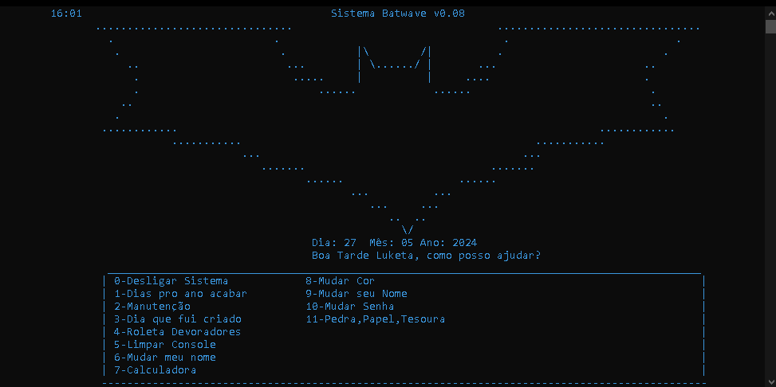
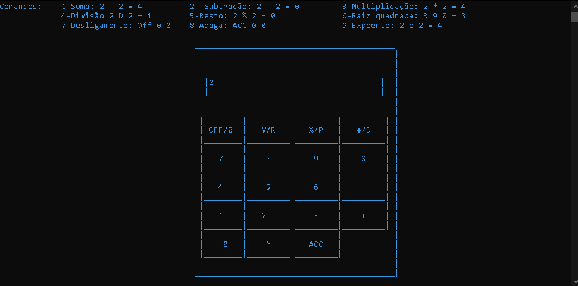

# BATWAVE BETA 0.08V
The "BatWave" project is inspired by the iconic system used by Batman, incorporating a series of advanced and
interactive features, developed in C#. This all-in-one system is designed to be a powerful tool for both everyday
use and entertainment, combining security, utility and customization.
Functionalities
      
0-Password and Password Change:
Implementation of an authentication system that requires a password to access the BatComputer.
Function to allow secure password change by the authenticated user.

1-Calculator:
A built-in calculator that can perform basic arithmetic operations, integrating a mathematical expression parser.

      
2-Roulette:
A roulette mini-game where the user can try their luck, using concepts of random generation and game logic.
      
3-System and User Name Change:
Functions to customize the system and user name, immediately reflecting these changes in the interface.
      
4-Real Time Date and Time:
Continuous display of date and time updated in real time, using threads to maintain accuracy.
Change of Visual Aspects:

5-Ability to change the color of the console, allowing users to customize the interface to their preferences.

6-Rock, Paper, Scissors Game:
Implementation of the classic Rock, Paper, Scissors game, with logic to determine the winner between the user and
the computer.

      
7-Greeting Recognition:
Function that recognizes the time of day (morning, afternoon, night) and greets the user accordingly, using the
current system time.
      
The project is developed using several advanced programming concepts in C#, including:
      
-Heritage:
Using inheritance to create a structure of classes that share common behaviors, as base classes for different
types
of games and tools.
      
-Recursion:
Implementation of recursive algorithms for functions that require repetitive calculations, such as when solving
complex mathematical problems.
      
-Exception Handling:
Use of try-catch blocks to manage errors and ensure that the system functions robustly and securely, especially in
critical operations such as authentication and data manipulation.
      
-Classes and Objects:
Creation of several classes to represent the system's functionalities, such as User, SystemSettings, and Game,
promoting an organized and modular structure.
      
-Data storage:
Implementation of methods to store and retrieve configuration data and user preferences, using text files and
databases.
